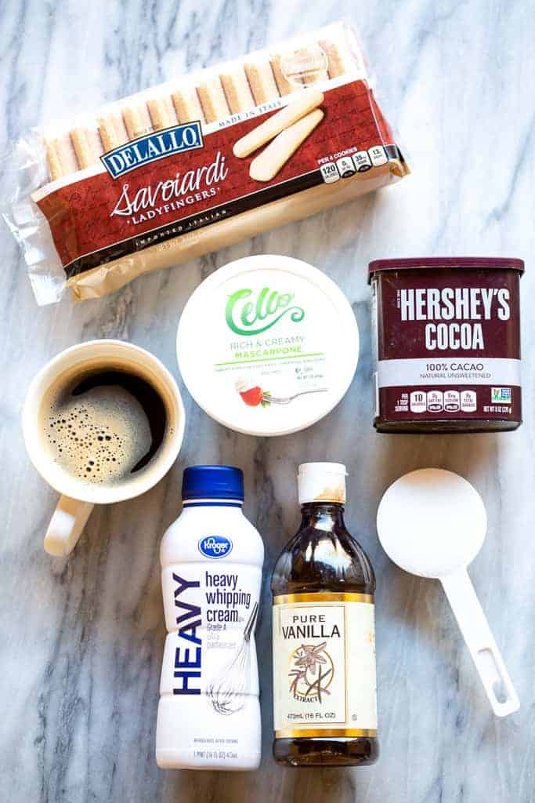

# Tina's Recipe
### How to Make Tiramisu
### This is a LOCAL change :)
line 2 changed remotely
Tiramisu Recipe
This is a simple recipe for making tiramisu that everyone can follow, with an option to make it alcohol-free. 
Refer to https://tastesbetterfromscratch.com/easy-tiramisu/ for the source of this recipe.
### This is a REMOTE change :O
### ***Things to Notice When Making Tiramisu (Ordered List)***
1. *Coffee Preparation: Choose strong, freshly brewed espresso or coffee from a moka pot. Avoid instant coffee or weak brews.*
2. *Ladyfingers Dipping: Dip the ladyfingers in coffee for only a few seconds to avoid soggy layers.*
3. *Resting Time: Allow the tiramisu to rest in the fridge for at least 2 hours to let the flavors meld and the texture set.*

